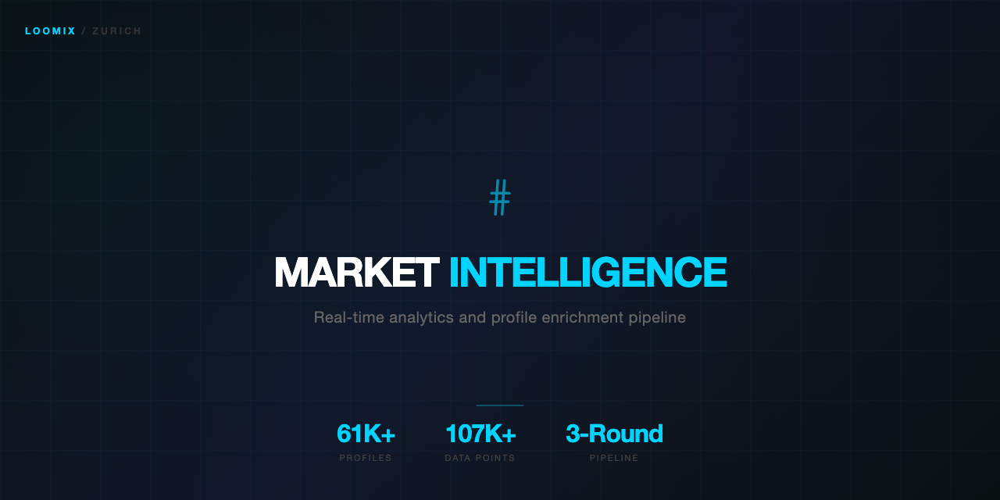

<p align="center">
  
</p>

<h1 align="center">Market Intelligence Dashboard</h1>

<p align="center">
  <strong>AI-powered audience analysis and competitor intelligence platform</strong>
</p>

<p align="center">
  
  
  
  
</p>

---

## Overview

A comprehensive market intelligence platform that scrapes, processes, and analyzes social media data at scale. Built for brands, agencies, and marketers who need actionable audience insights — not vanity metrics.

## What It Does

### 1. Data Collection
- Multi-platform scraping (Instagram, TikTok, YouTube, Reddit)
- Playwright worker-pool for reliable, rate-limit-aware collection
- 3-round deep analysis: posts → comments → commenter profiles

### 2. Audience Intelligence
- **Demographic Profiling** — Age, location, language, interests
- **Sentiment Analysis** — AI-powered opinion mining per topic/brand
- **Engagement Patterns** — When, how, and why audiences interact
- **Follower vs Audience Split** — Separate influencer followers from organic audience

### 3. Competitor Tracking
- Real-time competitor monitoring
- Content strategy reverse-engineering
- Share of voice analysis
- Pricing intelligence

### 4. Actionable Insights
- AI-generated strategic recommendations (Claude Opus 4.6)
- Content opportunity detection
- Trend prediction
- Audience overlap mapping

## Data Scale

| Metric | Production Numbers |
|--------|-------------------|
| Persons Analyzed | 61,159 |
| Comments Processed | 107,443 |
| Posts Tracked | 1,349 |
| Data Points | 160,000+ |
| Processing Pipeline | 3-round deep analysis |

## Tech Stack


### AI Analysis


## Architecture

```
┌──────────────────────────────────────────────────┐
│                  Data Collection                  │
│  Playwright Worker Pool (8 concurrent sessions)   │
│  Rate-limit aware • Proxy rotation • Anti-detect  │
├──────────────────────────────────────────────────┤
│                 Processing Pipeline               │
│  Round 1: Posts + Comments                        │
│  Round 2: Commenter Profile Deep-Dive             │
│  Round 3: Hyper-Classification (AI)               │
├──────────────────────────────────────────────────┤
│              Supabase (PostgreSQL)                │
│  61K persons • 107K comments • 1.3K posts         │
│  Full-text search • Real-time subscriptions       │
├──────────────────────────────────────────────────┤
│              Intelligence Dashboard               │
│  React + D3.js • Real-time charts                 │
│  Audience segments • Competitor matrix            │
│  AI-generated insights (Claude Opus)              │
└──────────────────────────────────────────────────┘
```

## Screenshots

> Dashboard screenshots coming soon — platform in active development.

## Use Cases

- **Influencer Marketing** — Find the right influencers based on real audience data, not follower counts
- **Brand Monitoring** — Track what people actually say about your brand across platforms
- **Market Entry** — Understand a new market's audience before launching
- **Content Strategy** — Know what content resonates with your target audience
- **Competitive Intelligence** — Reverse-engineer competitor strategies

## About

Built by **Daniel dos Santo Reis** — AI Engineer & Data Architect based in Zurich, Switzerland.
Part of the [Loomix](https://github.com/loomix-ai) ecosystem.

## License

Proprietary. Documentation, architecture, and aggregated metrics shared for portfolio purposes. Raw data and scraping logic are private.
