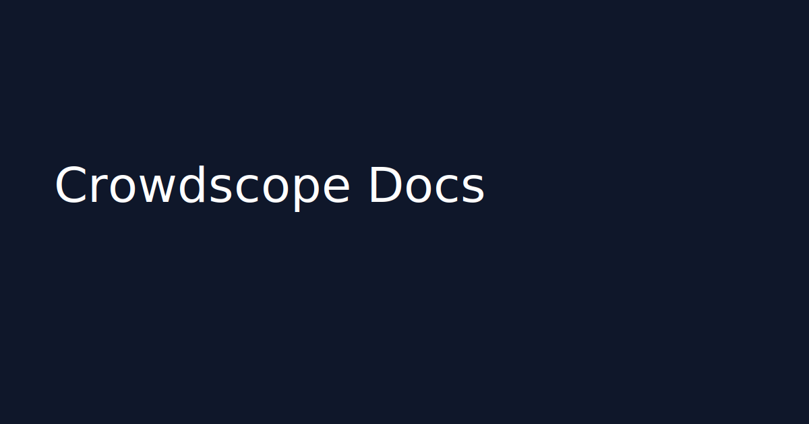
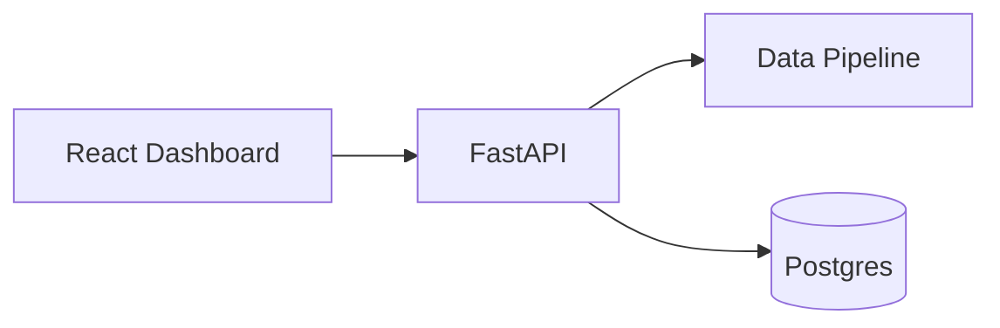

# Crowdscope Docs — Conversão para Astro Starlight




[](../../actions/workflows/docs-site.yml)

## Quickstart

```bash
npm ci
npm run dev
npm run build
```

## Architecture



## Benchmarks

- Static docs build under 3s local
- CDN-ready output

## Docker

```bash
docker build -t crowdscope-docs:latest .
docker compose up --build
```

## Kubernetes

```bash
kubectl apply -f k8s/
```

⭐ Star the repo if this docs setup helps your market intelligence workflow.
